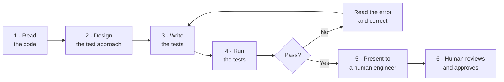
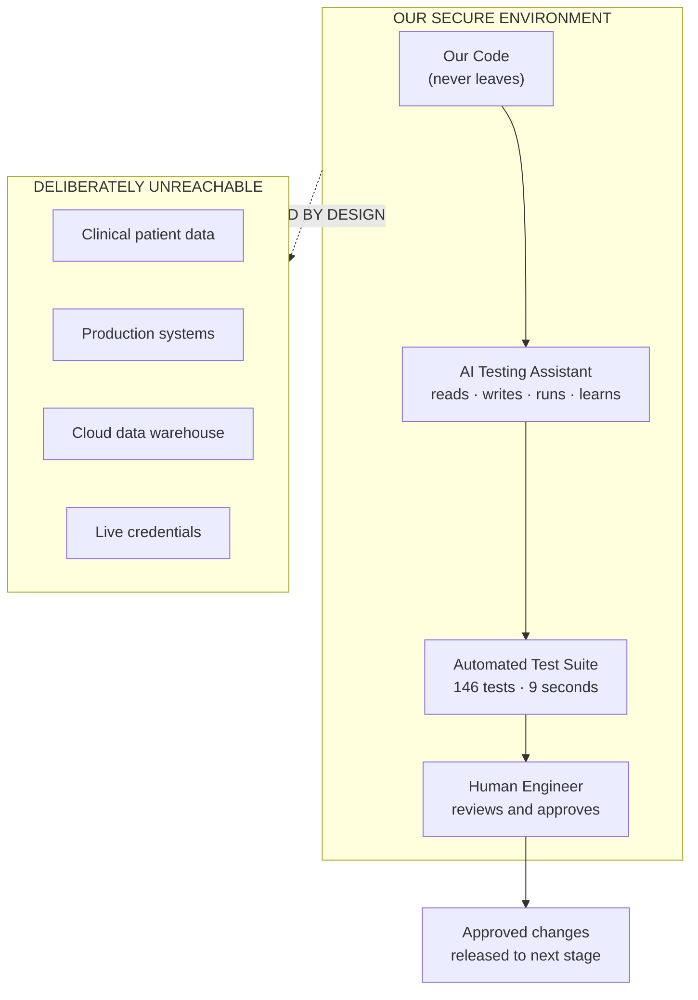
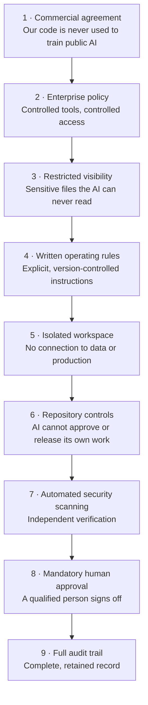
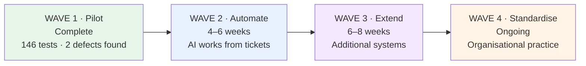

# Accelerating Software Quality with AI
## Automated Test Engineering for the Clinical Data Platform

**Prepared for:** Executive Leadership & Client Stakeholders
**Programme:** DDDA Clinical Data Platform (Koios)
**Date:** 3 September 2026
**Classification:** Internal / Client Shareable

---

## 1. Executive Summary

We piloted an **AI-powered testing assistant** on the Clinical Data Platform to answer a
simple business question:

> *Can artificial intelligence meaningfully reduce the cost and time of building quality
> assurance into our data pipelines — safely, and without our code ever leaving our control?*

**The answer is yes.** In a single working session, the AI assistant produced a complete
automated test suite for the platform's three core data layers.

### Results at a Glance

| Measure | Outcome |
|---|---|
| **Automated tests created** | **146** |
| **Time taken (AI-assisted)** | **≈ 2 working days** |
| **Equivalent manual effort** | **≈ 20 working days** |
| **Time saved** | **≈ 18 days — a 90% reduction** |
| **Live defects discovered** | **2** — including one affecting patient-data protection |
| **Test suite run time** | **9 seconds** |
| **Cloud compute cost to run tests** | **£0 / $0** |
| **Code sent outside our environment** | **None** |

### The Headline

We replaced a **four-week manual undertaking** with a **two-day supervised AI session** —
and in doing so uncovered two defects that were already live in our development environment.
One of them would have caused a **failure in the system that protects confidential patient
information**.

The pilot did not just save time. **It found problems that manual review had missed.**

---

## 2. The Business Problem

### 2.1 What Was at Risk

The Clinical Data Platform processes regulated clinical trial information — study subjects,
investigator sites, adverse events, enrolment milestones. It is business-critical and
subject to regulatory scrutiny.

Yet it had **effectively no automated safety net.**

| Without automated tests | Business consequence |
|---|---|
| Defects surface only when a pipeline fails in Dev or UAT | Delays, rework, re-running expensive cloud jobs |
| Engineers cannot safely modernise existing code | Technical debt compounds; delivery slows year on year |
| Quality evidence is manual and inconsistent | Weak position in audit and regulatory review |
| Business rules live in people's heads | Key-person dependency; painful onboarding |
| Every change carries unquantified risk | Teams become cautious; change velocity drops |

### 2.2 Why It Had Not Been Solved

Not through neglect — through **economics**.

Writing thorough tests for complex data pipelines is slow, meticulous work. A senior
engineer needs roughly **two to three days per module**. With competing feature deadlines,
testing is perpetually deferred. This is the single most common reason data platforms
across the industry carry low test coverage.

**The constraint was never willingness. It was cost.**

AI changes that equation.

---

## 3. What We Did

### 3.1 The Approach in Plain Terms

We gave an AI coding assistant a clear objective, access to our code **inside our own
secure environment**, and the ability to run tests and learn from the results.

It worked the way a good engineer works:

The critical difference from ordinary AI tools: **this assistant runs the tests and sees
real results.** It is not guessing at plausible-looking code — it is proving its work,
correcting itself when wrong, and only then bringing the outcome to a human.

### 3.2 The Solved Constraint

Our data pipelines normally require a large cloud computing cluster to run — expensive,
slow to start, and holding real data.

The assistant designed a **simulation layer** that lets the tests run on an ordinary laptop
or build server in **nine seconds**, with **no cluster, no cloud cost, and no access to
real patient data whatsoever**.

This single design decision delivers three business benefits at once:

| Benefit | Impact |
|---|---|
| **Speed** | Tests run in seconds, not minutes — engineers get instant feedback |
| **Cost** | Zero cloud spend on testing, permanently |
| **Safety** | The tests *cannot* reach real clinical data, because they never connect to it |

Security and cost efficiency here are the *same control*. The unsafe action is not merely
forbidden — it is impossible by design.

---

## 4. Architecture — How It Works

### 4.1 The Simple View

**Three things to take from this diagram:**

1. **Everything happens inside our boundary.** Our code is analysed within our own
   protected environment under enterprise agreements. It is not used to train public AI
   models and is not shared externally.
2. **The AI cannot touch real data.** Not by policy alone — by architecture. The testing
   environment has no connection to clinical data or production systems.
3. **A human always approves.** The AI proposes; a qualified engineer disposes. Nothing
   reaches a controlled environment without human sign-off.

### 4.2 Delivery Workflow

```mermaid
flowchart LR
    A["Engineer raises<br/>a request"] --> B["AI assistant<br/>builds the tests"]
    B --> C["Tests run<br/>automatically"]
    C --> D["AI presents<br/>results for review"]
    D --> E["Engineer reviews<br/>and approves"]
    E --> F["Automated safety<br/>checks pass"]
    F --> G["Quality Lead<br/>authorises release"]
    G --> H["Promoted to UAT"]

    style B fill:#e8f0fe
    style C fill:#e8f0fe
    style D fill:#e8f0fe
    style E fill:#fff4e5
    style G fill:#fff4e5
    style H fill:#e6f4ea
```

Blue steps are **automated**. Amber steps are **human decision points**. Green is the
**business outcome**.

The AI compresses the mechanical work. Humans retain every decision that carries risk.

---

## 5. Where the Time Is Saved

### 5.1 The Comparison

| Activity | Manual Effort | AI-Assisted | Time Saved |
|---|---:|---:|---:|
| Understanding the existing code | 1 day | 0.1 day | 90% |
| Designing the test approach | 3.5 days | 0.5 day | 86% |
| Writing tests — data ingestion layer | 2 days | 0.2 day | 90% |
| Writing tests — data quality layer | 5 days | 0.4 day | 92% |
| Writing tests — reporting layer | 5 days | 0.4 day | 92% |
| Debugging and fixing | 2 days | 0.2 day | 90% |
| Documenting the work | 1 day | 0.1 day | 90% |
| **Human review (does not compress)** | **—** | **1 day** | **—** |
| **TOTAL** | **≈ 20 days** | **≈ 2 days** | **≈ 90%** |

### 5.2 Visualising the Compression

```mermaid
gantt
    title Elapsed working days to a complete, verified test suite
    dateFormat X
    axisFormat %s days

    section Manual Approach
    Understand code       :0, 1
    Design approach       :1, 5
    Write tests           :5, 17
    Debug and document    :17, 20

    section AI-Assisted
    Understand code       :0, 1
    Design approach       :0, 1
    Write tests           :1, 2
    Human review          :1, 2
```

### 5.3 An Honest Note on the Numbers

We want these figures to survive scrutiny, so two important caveats:

**First — the 90% figure applies to this type of work.** Building a large volume of tests
from scratch is exactly where AI excels. For ongoing, smaller tasks the realistic saving is
**60–70%**, not 90%. We recommend planning against the conservative figure.

**Second — human review does not compress.** Approximately one day of expert review was
required, and always will be. This is not overhead to be optimised away; **it is the
control that makes the approach safe.** As we generate more tests, review capacity becomes
the planning constraint — and we have accounted for that in the roadmap.

### 5.4 Projected Savings — Forward View

| Scenario | Manual | AI-Assisted | Saving |
|---|---:|---:|---:|
| First module (approach must be designed) | 5 days | 1.5 days | 70% |
| Each subsequent module | 2.5 days | 0.4 days | **84%** |
| Topping up coverage on existing code | 1 day | 0.15 days | 85% |
| Test for a newly reported defect | 3 hours | 0.5 hours | 83% |

**Indicative annual impact for a team of six engineers:**

| Value Lever | Estimated Annual Benefit |
|---|---|
| Engineering days released to feature delivery | **40–60 days** |
| Cloud compute cost avoided on testing | Testing cluster spend **eliminated** |
| Defects prevented from reaching UAT/Production | 5–10× lower cost per defect caught early |
| Audit preparation effort | Materially reduced — evidence is automatic |

---

## 6. Business Value

### 6.1 Beyond the Time Saving

Time saved is the easiest benefit to measure, but it is not the most valuable one.

| Benefit | What It Means for the Business |
|---|---|
| **Defects found before they cost money** | Two live defects were caught in the pilot — one affecting patient-data protection. Finding these in production would have carried remediation, disclosure and reputational cost. |
| **Confidence to modernise** | Engineers currently avoid touching working code for fear of breaking it. A safety net turns "don't touch it" into "improve it safely." |
| **Faster, safer delivery** | Problems caught at the point of change, not weeks later in testing. Shorter cycles, fewer surprises. |
| **Audit and regulatory readiness** | Every test run produces timestamped, versioned, reproducible evidence — automatically. |
| **Reduced key-person risk** | Business rules are captured as executable tests. Knowledge stays with the organisation, not with individuals. |
| **Faster onboarding** | New engineers read the test suite to understand how the platform behaves. |

### 6.2 The Defects We Found — Why They Matter

| # | What we found | Business risk avoided |
|---|---|---|
| 1 | The system that protects confidential patient information contained a fault that would fail on certain data types | A **compliance and privacy incident** on regulated clinical data |
| 2 | Configuration processing generated invalid data keys from ordinary formatting | **Silent data-correctness risk** in downstream reporting |

Both were **already live in the development environment**. Neither had been caught by code
review. The second is notable because it is *silent* — it produces wrong results without
producing an error.

> This is the strongest argument for the investment. The pilot paid for itself on the first
> defect alone.

---

## 7. Safety, Confidentiality and Control

We recognise that "AI writing our code" prompts legitimate questions. Here are direct
answers.

### 7.1 Straight Answers to the Obvious Questions

| Question | Answer |
|---|---|
| **Does our code leave our environment?** | No. Work is performed within our enterprise-controlled boundary under commercial agreements that prohibit using our code to train public AI models. |
| **Can the AI see patient data?** | No. It never connects to clinical data systems. The tests use entirely invented data — fictional sites, fictional subject identifiers. |
| **Can the AI change our production systems?** | No. It can only write test files. Changes to real system code require explicit, individually recorded human approval. |
| **Can the AI release code by itself?** | No. Release to a controlled environment requires a named Quality Lead and Technical Lead to approve. |
| **What if the AI makes a mistake?** | Every output is reviewed by a qualified engineer before it is accepted. Automated safety checks run independently. Nothing merges unreviewed. |
| **What if it writes tests that always pass?** | We run deliberate verification to confirm tests genuinely fail when the code is wrong. |
| **Is this auditable?** | Fully. Every AI session, every code change, every approval and every test result is logged and retained. |

### 7.2 Layered Protection

### 7.3 The Governing Principle

> **The AI qualifies the work. A human authorises it.**

We have deliberately **not** automated the final release decision. For regulated clinical
data, a passing test suite should *earn a candidate the right to be considered* — it should
never *authorise the release itself*. That decision stays with accountable people.

---

## 8. Where Human Expertise Remains Essential

Being clear about the limits builds confidence in the claims.

| The AI handles well | A human is essential |
|---|---|
| Writing large volumes of repetitive test cases | Judging whether a **clinical business rule** is correct |
| Covering edge cases systematically | Deciding **risk trade-offs** on live systems |
| Correcting its own technical errors | Approving anything touching **patient-data protection** |
| Producing consistent documentation | **Regulatory** interpretation and validation strategy |
| Working tirelessly through mechanical detail | Confirming the tests check the **right** things |

**In short:** the AI knows what the code *does*. Only our people know what it *should* do.

We also apply a deliberate control against complacency: reviewers periodically perform deep
audits on a random sample, and we run automated verification that tests genuinely detect
faults. The risk of teams rubber-stamping green results is real, and we manage it actively.

---

## 9. What Is Required

### 9.1 Investment

| Item | Purpose | Notes |
|---|---|---|
| **AI assistant licences (Enterprise tier)** | Enables secure operation, policy controls and audit | Enterprise tier is **required** — lower tiers lack the governance controls |
| **Security scanning add-on** | Independent verification of AI output | Strongly recommended for regulated code |
| **Automation platform usage** | Running tests and checks | Minimal — our tests take 9 seconds |
| **Engineer review time** | The essential human control | ≈ 1 day per major module |
| **Cloud testing cost** | — | **Eliminated.** Tests need no data cluster. |

### 9.2 What We Already Have

The pilot demonstrated that the foundations are in place: the platform code, the operating
instructions for the AI, our existing release pipeline, and — most importantly — the
engineering judgement to supervise it. This is an incremental step, not a transformation
programme.

---

## 10. Roadmap

| Wave | Objective | Success Measure |
|---|---|---|
| **1 — Pilot** ✅ | Prove it works safely | 146 tests delivered · 2 defects found · zero security incidents |
| **2 — Automate** | AI works from tickets automatically | 5 consecutive AI submissions approved with no policy breaches |
| **3 — Extend** | Apply to further systems | Approach reused in 2+ areas · 70%+ of AI submissions accepted |
| **4 — Standardise** | Make it the organisational default | Quality-approved standard operating procedure in place |

### Recommended Next Steps

1. **Approve Wave 2.** Enable the AI assistant to work automatically from tickets, with all
   existing approval controls retained.
2. **Confirm the enterprise agreement** in writing with Legal and Procurement, and record
   the confirmation.
3. **Nominate accountable owners** — a Technical Lead for the AI operating instructions and
   a Quality Lead for the release gate.
4. **Set the measurement baseline** so Wave 2 benefits are evidenced, not asserted.

---

## 11. Recommendation

> **We recommend proceeding to Wave 2.**

The pilot delivered a **90% reduction in effort** on a task the organisation has repeatedly
deferred on cost grounds, and **found two live defects in the process** — one with direct
privacy and compliance implications.

The controls are proportionate and already proven in the pilot: our code stayed inside our
boundary, the AI never touched patient data, and every output passed human review.

The remaining decision is not technical. It is a straightforward business judgement:

**We can continue to defer quality assurance because it is expensive — or we can adopt an
approach that makes it affordable, and start closing the gap now.**

---

## Summary — One Page for the Board

| Question | Answer |
|---|---|
| **What did we do?** | Used an AI assistant to build a complete automated test suite for the Clinical Data Platform |
| **How long did it take?** | 2 days, versus 20 days manually |
| **What did it save?** | ≈ 18 engineering days — a 90% reduction |
| **What did it find?** | 2 live defects, one affecting patient-data protection |
| **What did it cost to run?** | £0 / $0 in cloud compute — tests run in 9 seconds |
| **Is our code safe?** | Yes — it never leaves our environment; enterprise agreement prohibits training use |
| **Is patient data safe?** | Yes — the tests cannot connect to clinical data by design |
| **Who approves changes?** | A qualified engineer, plus a Quality Lead for any release |
| **What is the ongoing saving?** | 60–85% on future testing work; 40–60 engineering days per year |
| **What do we recommend?** | Approve Wave 2 — automate the workflow, retain every control |

---

*Prepared by Data Engineering. Supporting technical specification available at
`tests/tech_specs.md`.*
